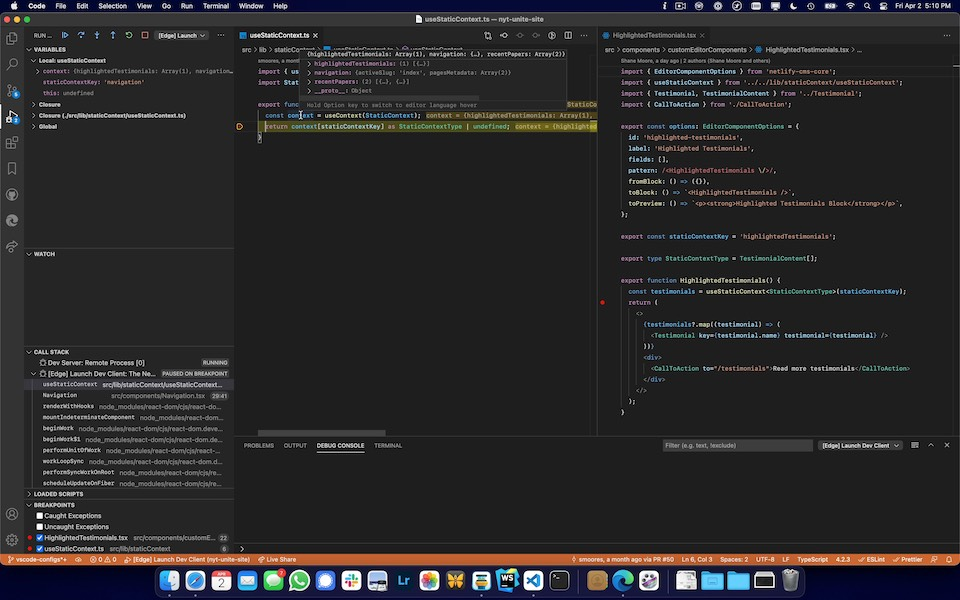

## Dependencies

- [yarn](https://yarnpkg.com)
- [TypeScript](https://www.typescriptlang.org/)
- [Next.js](https://nextjs.org/)
- [Netlify](https://www.netlify.com/)
- [MDX](https://mdxjs.com/)

## Getting started

Install dependencies:

```
yarn
```

Spin up development server:

```
yarn dev
```

**Note**: The local development server will publish to the live site. **Do not** publish anything locally that you don't want to go live!

View the CMS interface at [http://localhost:3000/admin/index.html](http://localhost:3000/admin/index.html).

## Debugging

You can use the provided Visual Studio Code configs to debug both the dev server and client.

### Attach the VSCode Debugger to the Dev Server

1. Use Visual Studio Code to [set debugger breakpoints](https://code.visualstudio.com/docs/editor/debugging).
2. Start `yarn dev:inspect` in a terminal.
3. In Visual Studio Code's **Run and Debug** sidebar (<kbd>Command</kbd> + <kbd>Shift</kbd> + <kbd>D</kbd>), select the **Dev Server** debugger profile from the menu and start it.
   - **Note:** You can click the "…" menu and choose "Start Additional Session" to run multiple debugger sessions simultaneously.
4. Perform an action (such as loading a web page in-browser) which will trigger the breakpoint/s.
5. Wait for the VSCode debugger to pause on your breakpoint/s.

### Launch and Debug Google Chrome or Microsoft Edge

1. Use Visual Studio Code to [set debugger breakpoints](https://code.visualstudio.com/docs/editor/debugging).
2. Start `yarn dev:inspect` in a terminal.
3. In Visual Studio Code's **Run and Debug** sidebar (<kbd>Command</kbd> + <kbd>Shift</kbd> + <kbd>D</kbd>), select either the **\[Chrome\] Launch Dev Client** or **\[Edge\] Launch Dev Client** debugger profile from the menu and start it.
   - **Note:** You can click the "…" menu and choose "Start Additional Session" to run multiple debugger sessions simultaneously.
4. Once the browser launches, perform an action (such as loading the page or clicking on an element) which will trigger the breakpoint/s.
5. Wait for the VSCode debugger to pause on your breakpoint/s.

### [Demo Video: VSCode Dev Server and Client Debugging](https://user-images.githubusercontent.com/191304/113455951-eee36b80-93d9-11eb-8a1c-dadc57b4da81.mp4)

<a href="https://user-images.githubusercontent.com/191304/113455951-eee36b80-93d9-11eb-8a1c-dadc57b4da81.mp4"></a>

## Scripts

### Processing Headshots

To preprocess headshots for the testimonials section of the website, you'll need to make sure you have `imagemagick`s `mogrify` command installed (on macOS, this can be installed via homebrew with `brew install imagemagick`).

Create a directory somewhere with your input files (say, `~/headshots`). Then run `yarn process:headshots ~/headshots/*`, which will process your input files (desaturate, adjust levels, resize, crop, and strip metadata) and output them in `public/images`, where they will be available to set as headshots for testimonials!

## Processes

### Updating Holiday Calendar

To update the holiday calendar download, update the `.ics` files in `public/` and update the resource links in `src/pages/resources.mdx`.

### See Also

- [Debugging in Visual Studio Code](https://code.visualstudio.com/docs/editor/debugging)
- [Advanced Features: Debugging | Next.js](https://nextjs.org/docs/advanced-features/debugging)
- [vscode-js-debug](https://github.com/microsoft/vscode-js-debug) - VSCode's built-in, [DAP](https://microsoft.github.io/debug-adapter-protocol/)-based JavaScript debugger for Node.js, Chrome, Edge, etc.

## References

- [Netlify CMS Documentation](https://www.netlifycms.org/docs/intro/)
- [Building a Markdown blog with Next 9.4 and Netlify](https://www.netlify.com/blog/2020/05/04/building-a-markdown-blog-with-next-9.4-and-netlify/)
- [Hugo Theme - Codex](https://github.com/jakewies/hugo-theme-codex)
- [Next.js Starter Template for TypeScript](https://github.com/vercel/next-learn-starter/tree/master/typescript-final)
- [Building Blog with NextJS and Netlify CMS](https://dev.to/mefaba/building-blog-with-nextjs-and-netlify-cms-fom)
- [Unicons](https://github.com/Iconscout/unicons)

## License

MIT
